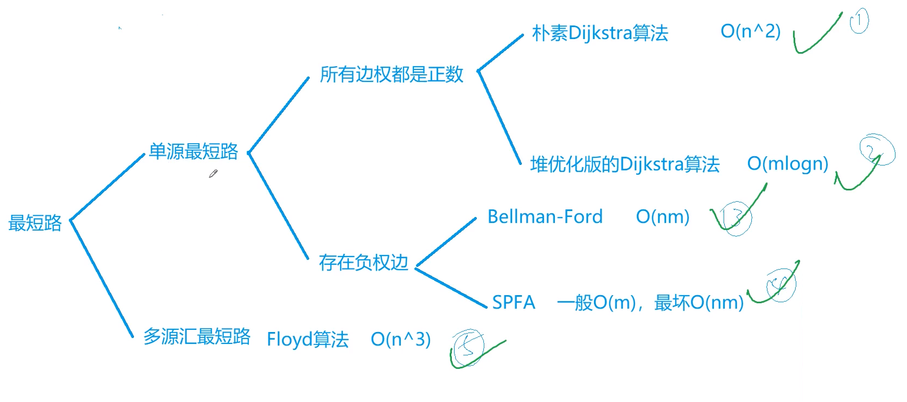

#最短路几种算法的图示

# 竞赛小知识
注意，这几种算法时间复杂度要记住，一般而言，根据竞赛的题目里，给出的**边和点**，可以大致推算要用什么算法。

比如给出==点很多==，那么一般不会使用Floyd、朴素Dijkstra。可以考虑堆优化的Dijkstra胡哦这Bellman、SPFA。

又或者，给出==边和点都很多==，那么只可能是堆优化的Dijkstra和SPFA，而如果SPFA过不了，那很可能就是出题人在卡SPFA，此时用堆优化的Dijkstra比较好。